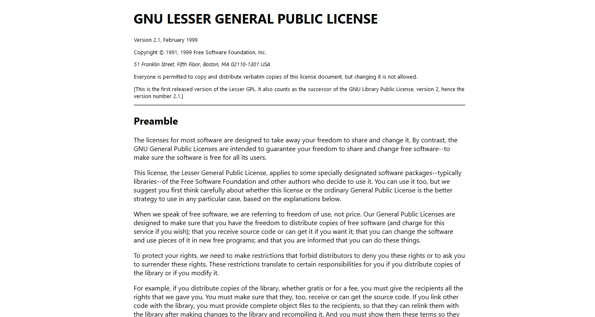

# Ren'Py Game Readme Boilerplate
[](http://unlicense.org/)

This is a starter template for Ren'Py game developers who want to make a robust HTML5 manual for their visual novel. Just download it, change some colors, add your text and images, and *voilà*!

It's based loosely on [the HTML manual I put together for Pizza Game](https://help.pizzagame.party/), which you can view online.

## Features
### Cool, semantic HTML5
#### Why make your manual an HTML document and not a txt file?
1. HTML allows linking between multiple documents, so you don't have to cram everything into one file.
1. Lengthy txt files require arbitrary line breaks to be readible, and are generally styled using ASCII art and other techniques that make them inaccessible to screenreaders.
1. HTML lets you include pictures, audio, video, functional web links, and of course, pretty styles to match your game!

#### Why make your manual an HTML document and not a PDF?
1. HTML is much easier to author and style than a PDF, and both can be accomplished using the text editor you already use for your Ren'Py game.
1. By that same token, updating an HTML manual is way easier and compatible with version control software your project might be using already.
1. [You can add accessibility features to HTML without proprietary software](https://equidox.co/blog/pdf-vs-html-which-is-the-best-route-to-reach-wcag-2-0/).
1. HTML is more suitable for digital viewing -- it's mobile-responsive and generally has a smaller file size.
1. Your resulting manual can easily be posted online as a website for users to view even without a copy of your game downloaded.

(However, if you plan to make a nice print version of your manual, you may in fact want to skip this repository and get some desktop publishing software instead.)

### Starter info
This boilerplate manual includes a basic troubleshooting section, minimum system requirements, save folder locations, and info on Ren'Py's licensing that you can use out of the box without having to rifle through Ren'Py's documentation.

### Scrollable table of contents
No need to worry about making your manual too long. An automatically generated table of contents sticks to the side of the page so users can get where they need to be. Keyboard users can skip over it using the hidden "skip to content" button (oh no, my WordPress is showing!!).

### License files
This starter pack includes readable, accessible, HTML5 versions of many open source licenses, including:

* Artistic License
* CC-BY-4.0
* CC-BY-3.0 (plus a human-readable version)
* GPLv2
* iconmonstr license
* LGPLv2.1
* MIT License
* Modified (3-clause) BSD License
* Pixabay license
* SIL-OFL 1.1
* Unlicense
* zlib license

as well as more specific licenses used by [Ren'Py and its dependencies](https://www.renpy.org/doc/html/license.html):

* Bitstream Vera License
* Bzip2 license
* FreeType Project License
* Independent JPEG Group License
* PNG License (for libpng)
* Python License

Here's an example of what they look like:



Big licenses like the LGPL have `<section>` elements with ids so you can link to just a part of the license if you're so inclined.

## How to use this library
Download the repository from the releases tab and extract it to your game folder. Or, if you have Git installed, use `git clone` to copy the project files to your game folder. You can delete any files you decide you don't need as you go along

The main readme file is by itself (called `help.html`), while all the subpages and supporting assets are located in a "help" folder. If you change this file structure around (like moving the main file into the "help" folder), remember to update file paths pointing to license pages and assets in `help.html`.

### Step 1: Replace generic names
To get started editing the file, do a find/replace all for the following terms, keeping the same format of spacing and capitalization. If your editor doesn't support find/replace across all project files, you'll have to do this for both help.html and style.css.

- `{Your Game}` / the name of your game
- `{Your Name}` / your name or the name of your development team
- `{Year}` / current year or year of game's copyright
- `{yourpatreon}` / your Patreon username in URL-friendly format
- `{Your CSS License}` / the name and/or URL of the license you want to place your custom manual stylesheet under.

### Step 2: Add and edit manual content
Fill out/edit the text of `help.html` (everthing inside the `<main>` tag) using the the default text and headings for guidance.

The table of contents is automatically populated using javascript, but it counts on the fact your heading tags don't have any additional attributes. To remove this auto-generation feature and create a table of contents manually, just remove the `<script>` tag at the bottom of the document.

Any paragraphs surrounded by braces should be replaced (or deleted) before releasing your game into the wild.

#### Basics
If you have altered Ren'Py's default keymap in any way, be sure the Controls section of the manual reflects the actual controls of your game.

##### Accessibility
The manual only documents Ren'Py's built-in accessibility features. If you're using a library like [minute's Accessibility Add-On](https://minute.itch.io/renpy-accessibility) or [npckc's Caption Tool](https://npckc.itch.io/caption-tool-for-renpy) that provides additional features such as subtitles, be sure to document those features.

Likewise, if you've removed any of the default accessibility features, make sure this section reflects what features are actually available in your game.

#### Credits
I've recreated the Patreon button in CSS, but the original button image is also in the `img` folder for your convenience.

#### Legal
(Insert obligatory IANAL disclosure here.)

The Ren'Py license section more or less encompasses what's on the LICENSE.txt file and Ren'Py's license page in the documentation. Ren'Py comes with its own license txt file and most of the file headers include license information, so you don't actually need to include all this copyright info in your manual if you're trying to slim down. It's mostly so end users can see all this info without internet connection and without having to root through the Ren'Py files in your game directory for a license.

Ren'Py's documentation lists FreeType under the zlib license, but the [FreeType licensing page](https://www.freetype.org/license.html) itself specifies you can use either GPL or their own FreeType Project License. I've included all three options and listed it in the boilerplate text under the FTL.

If you've removed the accessibility menu or the feature to change the game's font to OpenDyslexic and/or DejaVu Sans (and your game is not already using those fonts), you can remove the respective notices from the Copyrights section.

If you don't plan to release your game to Steam (or make use of the Steamworks API), you can remove Steamworks from the Copyrights section.

Additionally, it would be good to mention any Python modules you've added to your game (e.g., Discord RPC) in this section.

#### Deleting unnecessary files
For clarity, you may want to delete any files in the help folder you don't end up using, such as images.

The following license files are not used by Ren'Py or its dependencies, and can thus be deleted from the folder if you don't need them:
* cc3-human
* cc3
* cc4
* iconmonstr
* pixabay
* unlicense

### Step 3: Style your manual
Most of your style customizations (fonts, backgrounds, basic elements) can be managed in style.css.

This library includes some basic styling and elements from [https://picturepan2.github.io/spectre/](Spectre.css), so if you're going for a thorough stylization, be sure to look through spectre.css as well for some of the colors.

### Step 4: Add the manual to your game
For games that generally rely on Ren'Py's default menu structures and keyboard configuration, you can add the following to your `options.rpy` file:
```
define config.help = "help.html"
```

This will cause the "help" key (by default F1) and the Help button on the main and in-game menus to open your manual.

If you omit the above step, you can still open your manual from an in-game menu by giving it this action:

```
action Help("help.html")
```

## Changelog
### 1.0.0
- Initial release. I'm sure I'll find problems with it, but please be patient. My allergies are giving me dyspnea and I have no idea what's going on.

## To-do
- Some generic info on the installation/uninstallion process on Steam, Itch.io, etc. that could be used by most developers.
- Make more licenses have fields that can be populated by URL parameters.
- RTL styles

## License
Original content for this library (including dummy text, HTML, and CSS) is free to use, without attribution, under the terms of the Unlicense, with the understanding that there is no warranty of the legal fitness or thouroughness of this repository.

Texts of the licenses included here belong to their respective owners or exist in the public domain.

This library includes a modified version of Spectre.css, which is available under the [MIT License](https://github.com/picturepan2/spectre/blob/master/LICENSE).

The table of contents script is [Pure JS Table of Contents by Hendrik](https://codepen.io/aufmkolk/details/RWKLzr) on Codepen, available under the MIT License.

The external link SVG is from [iconmonstr](https://iconmonstr.com/share-11-svg/) and can be used in your readme without attribution as per [iconmonstr's license](https://iconmonstr.com/license/"). However, if you are the excessively thorough type, the iconmonstr license is also included in the licenses folder.

The Patreon button and logo belong to Patreon. You can view [Patreon's brand and button usage guidelines here](https://www.patreon.com/brand).

The [Game Accessibility Info](http://www.oneswitch.org.uk/game-access.htm) symbol is &copy; OneSwitch.co.uk, and may be used under the following guidelines:
```
1. The symbol is used only to denote "Game Accessibility Information".

2. When used with a game product the symbol is positioned in a prominent, easy to find place before the point of sale and/or download, alongside useful game accessibility information. This information must be freely available and be no more than a single click away.

3. The associated image pack zip file can be rehosted anywhere, providing that the README files are kept intact and/or reference the original source: http://www.oneswitch.org.uk/game-access.htm.

4. Slight cosmetic variations in design are permitted, providing that they remain very close to the original high-contrast design.
```
